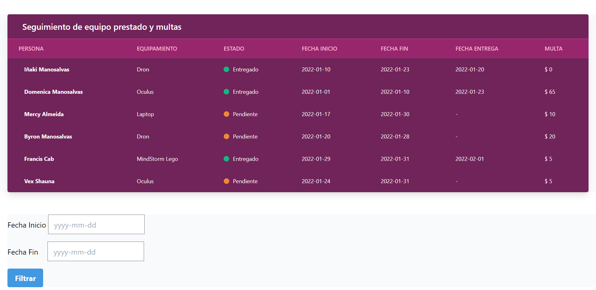
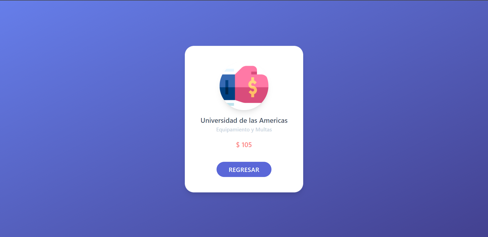

# App de Multas || NodeJS || Mongodb || MVC || Handlebars || ExpressJS

## Overview

This application was created for academic purposes. It is an exercise where several web technologies were used, the objective is to create an application that calculates fines under certain defined criteria, present it to the user, and finally allow a date filter to know the total to pay of the fines in that date range.

## Deployment

[IA-Multas-App Deployment in Heroku](https://ia-multas-app.herokuapp.com/)

## Technologies

* [Node JS](https://nodejs.org/es/docs/)
* [Express JS](https://expressjs.com/es/)
* [Handlebars](https://handlebarsjs.com/guide/)
* [Nodemon](https://nodemon.io/)
* [MongoDB](https://docs.mongodb.com/)
* [Heroku](https://www.heroku.com/)

## Setup

If you intend to download the project and test the functionality on your own, you must do some previous steps to have all the necessary configuration and packages used in the application.

Below I detail the small steps to carry out the setup of the project:

To install all the necessary node packages you must first have NodeJS installed. If you already have it on your computer, just run the following command in the console:

```
$ npm install
```

Now you will have to wait for all the dependencies to be installed successfully.

To run the project locally you can do it through two commands that I detail below:

* start
* dev

If you want to use the "start" command you must understand that it is for production execution.

```
$ npm run start
```

If you want to make use of the "dev" command you must understand that it is for execution in development.

```
$ npm run dev
```

When executing either of the two commands, the application will tell you on the console which port it is running on. (By default on port 3000)

## App illustrations

### Home Page



### Total fine filtered by date 



# Contact

* Personal e-mail: `inaki.manosalvas@gmail.com`
* Student e-mail: `inaki.manosalvas@udla.edu.ec`
* WhatsApp: [Direct msg to my chat from WhatsApp API](https://api.whatsapp.com/send/?phone=593989180423&text=Buen%20d%C3%ADa%20I%C3%B1aki,%20soy%20...&app_absent=0)